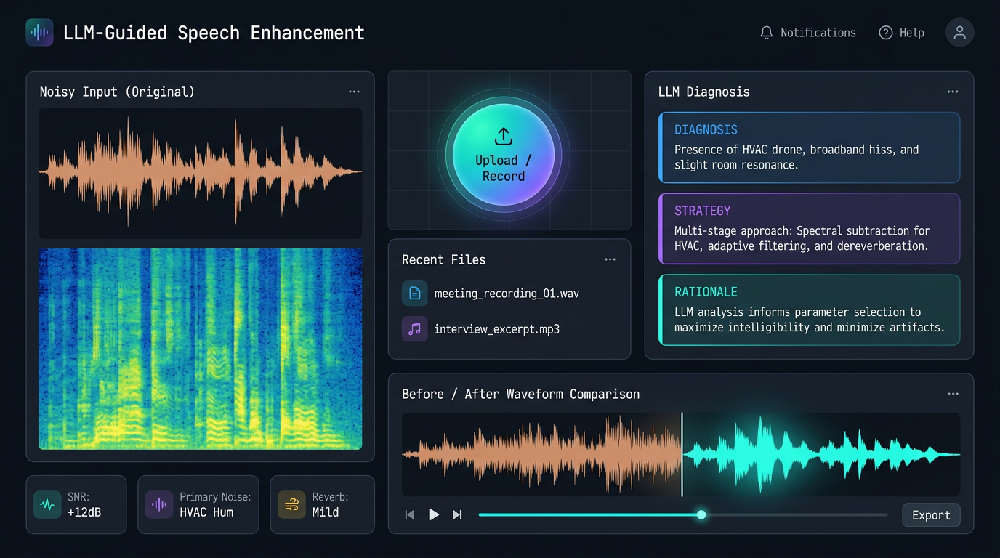
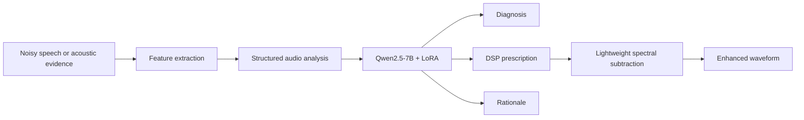

<div align="center">

# LLM-Guided Speech Enhancement

### From acoustic evidence to interpretable enhancement prescriptions

[](#quick-start)
[](https://pytorch.org/)
[](https://huggingface.co/docs/transformers)
[](LICENSE)
[](https://huggingface.co/jatshi/llm-guided-speech-enhancement)



*Interface preview. A recorded live demo will replace this preview when the hosted GPU demo is available.*

[Quick Start](#quick-start) · [Model files](#model-files) · [Architecture](#architecture) · [Documentation](#documentation) · [Limitations](#limitations)

</div>

---

## Why this project?

Most speech-enhancement systems map noisy waveforms directly to cleaner waveforms. This project explores a different interface: a language model reads a compact acoustic description and produces an **auditable prescription**—diagnosis, DSP strategy, and rationale. The demo then applies a lightweight spectral-subtraction backend using the prescribed strength.

It is useful when interpretability, operator control, and inspection of the enhancement decision matter as much as the processed audio.

| Capability | What it does |
| --- | --- |
| Acoustic diagnosis | Identifies noise, reverberation, bandwidth, and SNR cues from structured acoustic evidence. |
| Interpretable prescriptions | Emits a three-part response: diagnosis → DSP strategy → rationale. |
| Preference alignment | Uses SFT followed by DPO with LoRA adapters on Qwen2.5-7B-Instruct. |
| Runnable demo | Gradio supports text-only prescription generation and audio upload → analysis → lightweight enhancement. |
| Reproducible pipeline | Scripts cover synthetic degradation metadata, SFT/DPO data construction, training, and evaluation. |

## Architecture



The LLM is a **strategy generator**, not an end-to-end neural denoiser. The included audio backend is intentionally simple and serves to demonstrate how a generated prescription can control a conventional DSP operator.

## Quick Start

### 1. Create the environment

```bash
git clone https://github.com/Jatshi/llm-guided-speech-enhancement.git
cd llm-guided-speech-enhancement
python -m venv .venv
# Linux/macOS
source .venv/bin/activate
# Windows PowerShell: .venv\\Scripts\\Activate.ps1
pip install -r requirements.txt
```

For a CUDA environment, install the PyTorch build appropriate for your driver before installing the remaining requirements. The reference run used CUDA 12.1 and an RTX 4090 (24 GB).

### 2. Download the base model and adapter

```bash
# Base model (one-time)
python src/download_model.py

# Download the DPO adapter from the Model Files link below into outputs/dpo/final/
# or use: hf download jatshi/llm-guided-speech-enhancement dpo-adapter --local-dir outputs/dpo/final
```

Update `MODEL_PATH`, `DPO_ADAPTER`, and `SFT_ADAPTER` near the top of `src/app.py` if your local paths differ from the original server layout.

### 3. Launch the demo

```bash
python src/app.py
```

The demo exposes a text mode for inspecting prescriptions and an audio mode that extracts simple acoustic features, obtains a prescription, and writes an enhanced WAV file.

## Model Files

The model repository is [jatshi/llm-guided-speech-enhancement](https://huggingface.co/jatshi/llm-guided-speech-enhancement). It contains two LoRA adapters, not the Qwen base weights:

| Folder | Stage | Use |
| --- | --- | --- |
| `dpo-adapter/` | DPO | Recommended adapter for the demo and inference. |
| `sft-adapter/` | SFT | Supervised fine-tuning checkpoint before preference optimization. |

Load an adapter with PEFT:

```python
from transformers import AutoModelForCausalLM, AutoTokenizer
from peft import PeftModel

base_id = "Qwen/Qwen2.5-7B-Instruct"
tokenizer = AutoTokenizer.from_pretrained(base_id, trust_remote_code=True)
base = AutoModelForCausalLM.from_pretrained(base_id, device_map="auto", trust_remote_code=True)
model = PeftModel.from_pretrained(base, "jatshi/llm-guided-speech-enhancement", subfolder="dpo-adapter")
```

## Edge AI & Inference

The current release needs a Qwen2.5-7B base model plus a LoRA adapter, so it is best suited to a CUDA workstation/server. For edge-facing products, keep the LLM planner on a server or replace it with a smaller distilled strategy model; the downstream DSP stage itself is lightweight and can run locally.

The inference path is deliberately modular:

1. Compute or supply acoustic evidence.
2. Generate an interpretable enhancement prescription.
3. Parse parameters or route the prescription to a production DSP stack.

## Reproduce Training

The original pipeline uses AISHELL-1 clean speech with programmatically sampled degradations. It stores degradation configurations for the large training set and materializes a small evaluation-audio subset.

```bash
bash scripts/install_env.sh
python src/download_model.py
bash scripts/run_pipeline.sh
```

See [docs/architecture.md](docs/architecture.md) for the pipeline and [scripts/record_demo.md](scripts/record_demo.md) for the real-demo recording checklist.

## Repository Layout

```text
├── assets/readme/          # README visuals
├── docs/                   # Design and usage documentation
├── scripts/                # Environment, pipeline, and demo helpers
├── src/                    # Data, training, evaluation, and Gradio app
├── requirements.txt
└── LICENSE
```

Generated data, checkpoints, logs, WAV files, model weights, and archives are intentionally excluded from Git. See [.gitignore](.gitignore).

## Documentation

| Document | Description |
| --- | --- |
| [Architecture](docs/architecture.md) | Data flow, SFT/DPO stages, and deployment boundary. |
| [Demo recording](scripts/record_demo.md) | How to capture and optimize a real GIF from the live app. |
| [Model card](https://huggingface.co/jatshi/llm-guided-speech-enhancement) | Adapter provenance, intended use, and constraints. |

## Evaluation and Limitations

The delivered run reported 1.0 for diagnosis accuracy, format accuracy, and structure completeness on its synthetic held-out set. These metrics show that the pipeline learned the programmatically generated response format; they **do not** establish generalization to open-world audio or a perceptual advantage over modern neural speech-enhancement systems.

Important limitations:

- Training answers and preference pairs are programmatically constructed, so the evaluation is distribution-aligned and may be optimistic.
- The demo's enhancement operator is spectral subtraction, not a learned waveform-restoration model.
- No claim is made here about PESQ/STOI gains on standard real-world benchmarks.
- Please follow the licenses and terms for Qwen and AISHELL-1 when reproducing or redistributing derivatives.

## Git Policy

This repository contains source code, scripts, documentation, and small README assets only. Model parameters live on Hugging Face; generated data, raw audio, runs, checkpoints, logs, and local delivery archives remain untracked. This keeps clones fast and avoids redistributing data or artifacts unintentionally.

### Badge notes

The badges above are standard Shields.io image links. Replace the model URL or add CI/release badges after those services are configured; do not use a badge to imply a benchmark, deployment, or test result that has not been independently run.

## Citation

If this project supports your work, please cite the repository:

```bibtex
@software{shi2026llmguidedspeechenhancement,
  author = {Jianting Shi},
  title = {LLM-Guided Speech Enhancement},
  year = {2026},
  url = {https://github.com/Jatshi/llm-guided-speech-enhancement}
}
```

## License

Released under the [MIT License](LICENSE).
