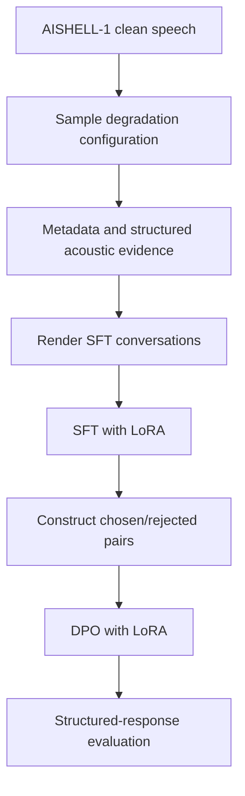

# Architecture

## Design goal

The project separates **reasoning about an enhancement decision** from **applying an enhancement operator**. The first component is a Qwen2.5-7B-Instruct model adapted with LoRA; the second is a lightweight spectral-subtraction implementation in the demo.

## Training path

`src/generate_degraded_data.py` records degradation configurations rather than storing all synthesized audio. `src/build_llm_data.py` turns these configurations into the three-part target response. `src/train_sft.py` and `src/train_dpo.py` produce the respective adapters.

## Inference path

`src/app.py` offers two modes:

- **Text mode:** accepts a structured `<audio_analysis>` block and generates a prescription.
- **Audio mode:** estimates simple features from an uploaded clip, generates a prescription, derives a strength value, and applies spectral subtraction.

The text model output should be treated as a transparent control layer. Production applications can replace the demo's parser and DSP backend with a validated enhancement stack without changing the LLM interface.

## Operational boundary

The original run used Qwen2.5-7B-Instruct on a 24 GB RTX 4090. The included adapters are small relative to the base model, but inference is not designed for constrained devices. A practical edge design keeps feature extraction and DSP on-device and calls a hosted planner, or distills the planner to a smaller model.
